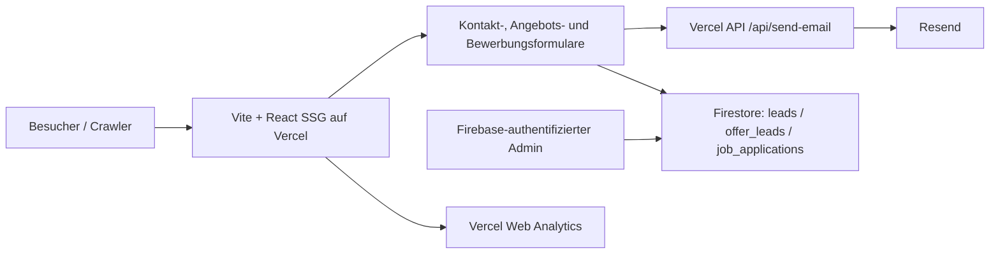

# AHAD Cleaning – Phase-1-Audit und priorisierte Bestandsaufnahme

Stand: 12. Juli 2026
Repository: `NeobotV2/Claude-Fable-5-Version-AHAD-`, Branch `main`, Commit `f8b8055`
Öffentliche Website: <https://www.ahad-cleaning.de/>

## 1. Executive Summary

AHAD hat bereits eine überdurchschnittlich klare B2B-Positionierung. Der Satz „Gebäudereinigung, die Sie nicht mehr nachsteuern müssen“, das AHAD-System, echte regionale Bilder, feste Objektleitung, Leistungs-/Branchenstruktur und ein kurzer Angebotsfunnel bilden ein gutes Fundament. Alle 36 URLs der Live-Sitemap liefern crawlbares HTML mit individuellem Title, individueller Description, genau einer H1 und syntaktisch lesbarem JSON-LD. Die aktuelle Gestaltung wirkt technisch, hochwertig und deutlich weniger austauschbar als viele lokale Wettbewerber.

Die größten Risiken liegen nicht in einem fehlenden Redesign, sondern in Inkonsistenzen zwischen Marketingversprechen, Routing, Domainkonfiguration und Leadtechnik:

1. **Kanonische Domain widerspricht dem Server.** Der Server erzwingt `www`, während Canonicals, Sitemap, robots, OG, JSON-LD und `llms.txt` den per 308 weiterleitenden Apex-Host nennen. Suchmaschinen erhalten damit siteweit widersprüchliche Signale.
2. **Der wichtigste Recruiting-Deep-Link ist kaputt.** `/karriere/bewerbung` wird von vielen CTAs verlinkt, liefert bei Direktaufruf oder Reload aber HTTP 404.
3. **Leadverarbeitung ist nicht robust genug.** Mail und Firestore werden getrennt clientseitig angestoßen. Firestore-Creates sind nur nach Feldanzahl begrenzt, nicht nach Schema, Typ oder Länge. Teilfehler, Spam, manipulierte Datensätze und Dubletten sind möglich.
4. **Der lokale Produktionsbuild ist nicht reproduzierbar.** `npm run build` bricht auf Windows im Prerender-Schritt ab, weil ein `C:\\...`-Pfad direkt per ESM-`import()` geladen wird.
5. **Vertrauensclaims brauchen ein Belegregister.** ISO 9001/14001, 80+, 15+, drei Standorte, Bewertungen, Garantien, laufende Stellen und Kundenlogos werden stark eingesetzt, aber ihre Freigabe, Quelle und Aktualität sind nicht versioniert dokumentiert.
6. **Accessibility und Progressive Enhancement sind noch nicht WCAG-2.2-AA-reif.** Mobile Navigation, Desktop-Dropdowns, Karriereformular-Labels, Marquee und animierte SSR-Zustände haben reproduzierbare Lücken. Ohne JavaScript bleiben viele Elemente durch `opacity:0` unsichtbar.
7. **CRO ist technisch blind.** Es gibt Seitenaufrufmessung, aber keine Events für CTA, Telefon, WhatsApp, Funnel-Schritte, Fehler, Abbruch oder Erfolg.

Empfehlung: Kein großflächiges Redesign beginnen. Zuerst Domain/Indexierung, Bewerbung, Build, Leadtechnik, Claims und A11y reparieren. Danach Funnel, Messung, Local SEO und Fallstudien ausbauen.

## 2. Scope, Methodik und Grenzen

Geprüft wurden:

- Repository-Struktur, Routing, SSR/SSG, wiederverwendete Komponenten und Datenmodelle
- Metadaten, JSON-LD, Sitemap, robots, Redirects und Canonicals
- Live-Crawl der 36 Sitemap-URLs plus fünf zusätzliche App-/Legacy-Routen
- 40 konfigurierte Legacy-Redirects und HTTP/HTTPS-/www-/Apex-Varianten
- Desktop- und Mobile-Ansicht, Navigation, Angebotsfunnel und Accessibility Tree
- Formulare, Firestore-Regeln, Admin, Resend-API, Tracking und Datenschutztext
- Build, Bundlegrößen, Bilder, Fonts und ausgelieferte Header
- Stichproben zu realen Suchergebnissen, Wettbewerbern und lokalen Unternehmenszitaten

Nicht verfügbar waren Google Search Console, Bing Webmaster Tools, Google Business Profile, Vercel-/Firebase-/Resend-Logs, CRM-Daten, echte Leadqualität, Zertifikatsdateien, Kundenfreigaben und Feld-CWV aus CrUX. Die PageSpeed-API war zum Prüfzeitpunkt rate-limitiert. Aussagen zu Rankings, Google-selected Canonicals, Backlinks, GBP-Kategorien und Rechtskonformität sind deshalb als offene Verifikation markiert. Dieses Dokument ist keine Rechtsberatung.

Reproduzierbare Artefakte:

- [URL-Inventur](./2026-07-12-url-inventar.csv)
- [Redirect-Matrix](./2026-07-12-redirect-matrix.csv)
- [Priorisierte Aufgabenliste](./2026-07-12-aufgabenliste.csv)
- [Read-only Live-Crawler](../../scripts/audit-live.mjs)

## 3. Technische Bestandsaufnahme

### Stack und Architektur

- React 18.3, TypeScript 5.7, Vite 6.4, React Router 7
- Tailwind CSS 4, Motion, Lucide, React Helmet Async
- Client-Build plus SSR-Bundle plus eigenes statisches Prerendering
- Vercel als aktuelle Live-Plattform; Netlify und GitHub Pages zusätzlich dokumentiert
- Vercel Serverless Function für Resend-E-Mails
- Firebase Auth/Firestore für Leadablage und Admin-Dashboard
- Vercel Web Analytics für cookielose Reichweitenmessung
- Lokale variable Fonts; überwiegend lokale responsive WebP-Bilder



### Positiv

- Leistungen und Branchen sind datengetrieben und nutzen wiederverwendbare Templates.
- Kontaktdaten, zentrale Statistiken, Referenzen und viele Claims sind in `src/lib/site.ts` gebündelt.
- Seiten werden lazy geladen; Firebase wird in öffentlichen Formularen erst beim Absenden importiert.
- Mail-HTML wird serverseitig escaped; JSON-LD wird gegen Script-Ausbruch gehärtet.
- HSTS, `nosniff`, `DENY` für Frames, Referrer- und Permissions-Policy sind live vorhanden.
- `npm audit` meldete zum Prüfzeitpunkt keine bekannten Advisories.

### Architektur- und Betriebsprobleme

- Die Hostingziele sind nicht funktionsgleich: Nur Vercel hat Mailfunktion, Legacy-Redirects und Security-Header.
- Die Mail-/Firestore-Verarbeitung ist kein atomarer Workflow und hat keine Idempotency-ID.
- Firestore-Rules erlauben anonyme Creates mit nahezu beliebigem Inhalt, solange die Map weniger als 40 Felder hat.
- Admin-CSV ist anfällig für Formula Injection (`=`, `+`, `-`, `@`).
- Admin lädt alle drei Collections unpaginiert als Realtime-Listener.
- Datenschutz-Löschfristen sind nicht als TTL, Job oder Admin-Funktion operationalisiert.
- Angebot speichert später auch Name, E-Mail, Telefon und Ort ohne TTL im `localStorage`.
- Keine Testskripte, kein Linting und keine PR-CI; API und Neben-Vite-Configs werden nicht vollständig typgeprüft.
- Prerender-Fehler degradieren laut Script bewusst zur SPA-Hülle und lassen den Build weiterlaufen.
- Unter Windows scheitert der Prerender aktuell schon vor der Routenerzeugung mit `ERR_UNSUPPORTED_ESM_URL_SCHEME`.

## 4. Bestehende Informationsarchitektur

```text
/
├─ Leistungen
│  ├─ Unterhaltsreinigung
│  ├─ Industrie- & Produktionsreinigung
│  ├─ Glas- & Fassadenreinigung
│  ├─ Baureinigung
│  ├─ Medizintechnik-Reinigung
│  ├─ Sonderreinigung & Stillstandsservice
│  ├─ Winterdienst & Hausmeisterservice
│  └─ Küchenabluftreinigung nach VDI 2052
├─ Branchen
│  ├─ Industrie & Produktion
│  ├─ Medizintechnik
│  ├─ Büro & Verwaltung
│  ├─ Gewerbeobjekte
│  └─ Hotellerie & Objektbetrieb
├─ Das AHAD-System
├─ Referenzen
├─ Unternehmen
├─ Standorte
│  ├─ Villingen-Schwenningen
│  ├─ Stuttgart / Echterdingen
│  └─ Konstanz
├─ Fachwissen
│  └─ 8 Fachartikel
├─ Karriere
│  └─ Bewerbung (App-Route vorhanden, live als Deep Link 404)
├─ Kontakt
├─ Angebotsfunnel
└─ Impressum / Datenschutz
```

Die Desktop-Hauptnavigation begrenzt gleichrangige Punkte sinnvoll auf Leistungen, Branchen, AHAD-System, Referenzen und Unternehmen; Standorte, Karriere, Fachwissen und Kontakt liegen unter Unternehmen. Footer und Breadcrumbs ergänzen die Navigation. Die IA ist grundsätzlich skalierbar. Fehlend sind derzeit echte Fallstudien als eigener Seitentyp, Autorenprofile und eine klare technische Quelle der Wahrheit für Routen/Indexierung.

Karriere und Fachwissen bedienen jedoch andere Journeys als die Unternehmensvorstellung. Beide sind auf Desktop zusätzlich durch das hoverabhängige „Unternehmen“-Menü und mobil durch ein Accordion verborgen. Ein First-Click-/Tree-Test sollte klären, ob Karriere und Fachwissen als sichtbare Sekundäreinstiege besser funktionieren.

## 5. Bestehende Nutzerwege

| Zielgruppe | Aktueller Einstieg | Stärken | Bruch / Lücke |
|---|---|---|---|
| Facility Management | Home → Leistung/Branche → AHAD-System → Angebot | Feste Objektleitung, Dokumentation und Reklamationsreduktion sind klar | Kein Leistungsverzeichnis-Download, kein Kontext-Tracking |
| Einkauf | Home/Fachwissen → Kosten/LV/Anbieterwechsel → Angebot | Vergleichbarkeit, Festpreis und LV werden adressiert | Keine belegten Kalkulationsfälle; Claims nicht versioniert |
| Produktionsleitung | Industrie-/Produktionsseiten → Angebot | Schichtbetrieb, UVV und Prozessstörung werden verstanden | Funnel fragt Produktionsart, Anlagen und Schichten nicht dynamisch ab |
| Qualitätsmanagement | Medizintechnik/ISO/VDI → AHAD-System → Angebot | Audit, SOP, Nachweise und Hygiene sind sichtbar | Fachquellen, Zertifikatsdetails und fachlich verantwortliche Person fehlen |
| Geschäftsführung | Home → Referenzen/System → Angebot/Anruf | Risikoreduktion und geringer Steuerungsaufwand sind stark | Viele gleichzeitige Versprechen ohne Claim-Register |
| Bewerbende | Karriere → offene Profile → Bewerbung | Mobile, mehrsprachige Kurzbewerbung und Nutzenargumente | Bewerbung-Deep-Link/Reload 404; Jobdaten statisch und nicht datiert |

## 6. URL-, Redirect- und Indexierungsinventur

### Live-Inventur

- 36 URLs in der Live-Sitemap, alle auf dem `www`-Host mit HTTP 200.
- 36/36 haben individuellen Title, individuelle Meta Description und genau eine H1.
- 36/36 liefern parsebares JSON-LD.
- Keine Sitemap-URL ist intern verwaist.
- 41 Routen wurden insgesamt inventarisiert: 36 Sitemap-URLs plus `/angebot`, `/karriere/bewerbung`, `/admin`, `/reinigungskonzept`, `/kostenrechner`.
- `/angebot` ist 200 und indexierbar, aber aus der generierten Sitemap ausgeschlossen. Der Kommentar nennt es `NOINDEX`, technisch wird jedoch kein `noindex` ausgegeben.
- `/karriere/bewerbung`, `/admin`, `/reinigungskonzept` und `/kostenrechner` liefern live HTTP 404. Die ersten drei sind im Router definiert; die beiden Legacy-Aliasse sollen clientseitig navigieren, sind als Deep Link aber wirkungslos.
- Zufällige unbekannte URLs lieferten im Live-Test korrekt HTTP 404. Die Catch-all-Konfiguration bleibt für alternative Hoster und nicht vorgerenderte Routen ein Risiko, ist aber **kein aktuell bestätigter Live-Soft-404 für Zufallspfade**.

### Kritischer Hostkonflikt

Der produktive Server leitet `https://ahad-cleaning.de/...` per 308 auf `https://www.ahad-cleaning.de/...`. Gleichzeitig zeigen alle Canonicals und fast alle maschinenlesbaren Identifikatoren zurück auf den Apex-Host. Auch die Sitemap listet ausschließlich Apex-URLs und erzeugt daher für jede eingetragene URL zunächst einen Redirect.

Betroffen sind:

- Canonical und OG/Twitter in `src/components/SEO.tsx`
- `SITE.url`, Organization-, Review- und WebSite-Schema
- hart codierte Article- und Standort-IDs
- `scripts/prerender.mjs`, `public/sitemap.xml`, `public/robots.txt`
- `public/llms.txt` und statische Fallback-Tags in `index.html`

### Trailing Slash

Alle 35 Nicht-Root-Sitemap-URLs liefern sowohl ohne als auch mit Slash HTTP 200. Canonical zeigt jeweils auf die Variante ohne Slash. Das kontrolliert Duplicate Content, verschwendet aber Crawlbudget und lässt Suchergebnisse weiter alte Slash-URLs zeigen. Eine serverseitige Slash-Policy fehlt.

### Legacy-Redirects

Die 40 in `vercel.json` konfigurierten Redirects funktionieren auf dem `www`-Host wie vorgesehen als 301. Beispiele:

- `/glas-und-fassadenreinigung/` → `/leistungen/glas-fassadenreinigung`
- `/maschinenreinigung/` → `/leistungen/industrie-produktionsreinigung`
- `/hausmeisterservice/` → `/leistungen/winterdienst-hausmeisterservice`
- `/online-buchung/` → `/kontakt`

Bei Apex-/HTTP-Varianten entstehen zwei bis drei Hops, bevor das endgültige Ziel erreicht wird. Die vollständige Matrix steht in der CSV-Datei.

## 7. UX- und UI-Audit

### Stärken

- Markenwirkung entspricht dem B2B-Zielbild: Dunkelblau, Grün, Montserrat, klare technische Raster und reale AHAD-Bilder.
- Hero benennt Zielgruppe, Problem, Nutzen und regionalen Kontext ohne Haushaltsreinigungsästhetik.
- AHAD-System wird als verständliche Vier-Schritt-Logik erklärt.
- Leistungs- und Branchenmodule sprechen betriebliche Ergebnisse statt nur Tätigkeiten an.
- Echte namentliche Kundenstimme ist deutlich stärker als ein reines Logo-Band.
- Mobile Header-, Telefon- und Sticky-Aktionen sind touchfreundlich dimensioniert.

### Probleme

- Bei 390 × 844 liegt der primäre Hero-CTA unterhalb der ersten Bildschirmhöhe. Der mobile Sticky-CTA erscheint erst nach 480 px Scroll.
- Der sichtbare Startbereich konkurriert mit vielen Vertrauensaussagen: Rating, feste Teams, Objektleitung, Kennzahlen und Garantieclaims.
- Noch vor dem Leistungsinhalt folgen weitere Kennzahlen, Trust-Band und Logo-Marquee. Auf Mobilgeräten verlängert das den Weg zur inhaltlichen Leistungsorientierung.
- Sehr lange Startseite mit wiederholten Vertrauens- und CTA-Blöcken; ihre Reihenfolge ist plausibel, aber noch nicht durch Funnel-/Scroll-Daten validiert.
- Reveal-Animationen machen Inhalte kurz nach dem Laden sehr blass; ohne JavaScript bleiben viele Inhalte/Bilder unsichtbar.
- Logo-Marquee erzeugt 33 Bildknoten und bewegt sich 42 Sekunden automatisch; Pause funktioniert nur per Hover.
- Die mobile Menüebene bleibt für Screenreader zusammen mit dem Seitenhintergrund zugänglich.
- Nach dem Scrollen konkurrieren die feste Anrufen-/Besichtigung-Leiste und ein zusätzlicher WhatsApp-Float als drei dauerhafte Aktionen. Der Footer kompensiert die Überdeckung, die Priorisierung bleibt aber unklar.

## 8. Conversion- und Funnel-Audit

### Positiv

- Primäre Conversion ist siteweit konsistent: kostenlose Besichtigung.
- Anruf, WhatsApp, Kontakt und Angebot bieten alternative Wege.
- Angebotsfunnel hat vier verständliche Schritte und fokussiert nach Schrittwechsel den neuen Bereich.
- Kontaktformular besitzt sichtbare Labels und Honeypot.
- Erfolgs-/Fehlerzustände und direkte Telefonnummer sind grundsätzlich vorhanden.

### Conversion-Blocker

- Bewerbungsfunnel ist per Direktlink/Reload nicht erreichbar.
- Angebotsfunnel bildet nur vier Leistungsgruppen ab, obwohl acht Leistungen vermarktet werden.
- Keine serviceabhängige Progressive Disclosure für Glas, Industrie, Bau, Winterdienst oder Medizintechnik.
- Kein automatischer Kontext für Einstiegsleistung, Branche, Region, Kampagne, UTM, Referrer oder Landingpage.
- Firma, Name, E-Mail, Telefon und Ort sind gleichzeitig Pflicht. Für frühe Leads sollte geprüft werden, ob E-Mail **oder** Telefon genügt.
- „Ihr Angebot in 24 Stunden“, „vier kurze Fragen“ und „60 Sekunden“ widersprechen dem tatsächlichen Ablauf aus vier Schritten, mehreren Auswahlen und fünf Pflicht-Kontaktfeldern. Der Funnel selbst erklärt richtigerweise: Antwort/Terminvorschlag in 24 Stunden, Angebot erst nach Besichtigung.
- Datenschutz-Links können Kontakt- und Bewerbungsfortschritt durch Navigation/Reload verlieren. Beim Angebot bleibt der Fortschritt nur wegen des problematischen persistenten `localStorage`-Entwurfs erhalten.
- Erfolgsanzeige schon dann, wenn nur Mail **oder** Firestore erfolgreich war; damit kann der Lead außerhalb des primären Workflows liegen.
- Kein globaler Spam-Schutz für Angebot/Karriere und kein zuverlässiges instanzübergreifendes Rate Limit.
- Kein Eventtracking für Start, Schritt, Fehler, Abbruch und Erfolg.
- Karriere-Karten übergeben keine Job-ID, Rolle oder Region; der Funnel fragt die Position erneut. Bewerbende sehen vor dem Start keine rollenbezogenen Aufgaben/Anforderungen.
- Die Referenzseite besteht hauptsächlich aus Logos und fünf Reviews. Mehrere Google-Stimmen wirken eher privat-/fensterreinigungsnah; belastbare B2B-Cases mit Objekt, Scope, AHAD-Vorgehen und Ergebnis fehlen.

## 9. SEO-Audit

### Stärken

- Gute Seitentypabdeckung für Leistungen, Branchen, Standorte und Informationsintentionen.
- Crawlbares SSR-HTML statt leerer Client-Shell auf allen 36 Sitemap-Seiten.
- Individuelle Titles, Descriptions und H1; keine internen Waisen im Sitemap-Set.
- Breadcrumb-, Service-, Article-, LocalBusiness-, Organization- und FAQ-Schema sind breit implementiert.
- Interne Links zeigen innerhalb des Sitemap-Sets nicht auf Legacy-Redirects.

### Probleme

- Siteweiter kanonischer Hostkonflikt und redirectende Sitemap-URLs.
- Trailing-Slash-Duplikate bleiben als 200 erreichbar.
- Eine kaputte interne Ziel-URL: `/karriere/bewerbung`.
- Indexierungsabsicht des Angebotsfunnels ist widersprüchlich.
- Sieben Titles sind länger als etwa 60 Zeichen; 15 Descriptions länger als etwa 160, acht davon über 180 Zeichen. Das ist kein Rankingfehler, erhöht aber das Risiko abgeschnittener oder umgeschriebener Snippets.
- Self-serving `AggregateRating`/Review-Markup auf der eigenen Organization/LocalBusiness-Seite ist nicht für Review-Sterne eligible und sollte nicht als Rich-Result-Hebel betrachtet werden.
- FAQ-Markup kann für semantische Klarheit bleiben, Google zeigt FAQ-Rich-Results für diese Branche jedoch praktisch nicht mehr.
- Artikel-Schema hat teilweise kein repräsentatives `image`; harte Schema-URLs duplizieren die falsche Apex-Basis.

## 10. Local-SEO-Audit

### Positiv

- Eigenständige, inhaltlich differenzierte Seiten für Villingen-Schwenningen, Stuttgart/Echterdingen und Konstanz.
- Sichtbare Hauptadresse, Telefon, E-Mail, Öffnungszeiten und regionale Leistungsbezüge.
- HQ-Daten werden in externen Verzeichnissen grundsätzlich wiedergefunden.

### Offene Risiken

- Vor Veröffentlichung als `LocalBusiness` muss je Adresse geklärt sein, ob es eine echte, zulässige und besetzte Niederlassung oder nur ein Einsatzgebiet ist.
- Stuttgart-Seite nennt Humboldtstraße 27 in 70771 Echterdingen, verwendet aber Koordinaten nahe Stuttgart-Zentrum.
- Für dieselbe HQ-Adresse werden in Organization- und Villingen-Schema unterschiedliche Koordinaten gepflegt.
- `GOOGLE_RATING.url` ist leer; Nutzer und Schema erhalten nur eine generische Google-Maps-Suche statt der exakten Business-Profile-URL.
- Stichproben in Drittverzeichnissen zeigten 09:00–17:00 statt der Websiteangabe 08:00–17:00.
- Für Stuttgart- und Konstanz-Adressen wurde in der begrenzten externen Stichprobe keine gleich starke unabhängige Bestätigung wie für das HQ gefunden.

## 11. GEO-/AI-Search-Audit

### Gute Grundlage

- Eindeutige rechtliche Entität, Adresse, Telefon, Leistungen, Branchen und AHAD-System sind in SSR-HTML erklärbar.
- `llms.txt`, FAQs, Service-/Article-Schema und klare Zwischenüberschriften verbessern Maschinenlesbarkeit.
- Echte Bilder, echte Referenzen und regionale Seiten sind besser als generische KI-Massentexte.

### Größte Potenziale

- `llms.txt` enthält den falschen Host sowie mutable Ratings, Preise und Claims; diese Angaben brauchen denselben Pflegeprozess wie die Website.
- Fachartikel besitzen meist nur die Organisation als Autor, keine echte Fachperson und kaum externe Primärquellen.
- ISO-, VDI-, Tarif-, Rechts- und Preisangaben müssen mit Quelle, Aktualisierungsdatum und klarer Trennung zwischen Norm, Empfehlung, AHAD-Erfahrungswert und Schätzung versehen werden.
- Reale Fallstudien, Qualitätskontrollbeispiele, Muster-Leistungsverzeichnisse und dokumentierte Anbieterwechsel würden die Entität stärker machen als zusätzliches Schema.
- Branch-/Standortknoten sollten sauber mit der Hauptorganisation verknüpft und mit exakten Business-Profile-URLs bestätigt werden.

## 12. Performance- und Core-Web-Vitals-Audit

### Gemessene Build-/Auslieferungswerte

- Startseiten-HTML live: ca. 165,7 KB unkomprimiert; 60 Vorkommen von `opacity:0` im SSR-Markup.
- Komprimierte Startseiten-HTML-Stichprobe: ca. 25,5 KB; TTFB in Einzelmessungen ca. 0,106–0,183 Sekunden.
- Unterhaltsreinigungs-HTML live: ca. 66,5 KB; 19 Vorkommen von `opacity:0`.
- Initiale Kern-JS-Chunks laut lokalem Client-Build: ca. 493 KB roh / 158 KB gzip (`index`, `react`, `motion`).
- CSS: 106,7 KB roh / 16,5 KB gzip.
- Drei lokale variable Fonts: zusammen ca. 108,5 KB.
- Lokale Bilder: ca. 3,08 MB über 93 Dateien; größtes Basis-WebP ca. 126 KB; responsive 480/960-Varianten sind überwiegend vorhanden.
- Firebase-Chunk: ca. 110,5 KB gzip, aber öffentlich erst bei Submit/Admin relevant.

### Befunde

- Startseiten-Hero ist lokal, responsiv, `eager` und high-priority – positiv für LCP.
- Vier Fachartikel-Heroes und weitere Stockmotive laden direkt von Unsplash; mehrere Heroes umgehen `SmartImage`, `srcset` und die lokale Bildpipeline.
- `Reveal` und `SmartImage` verwenden unsichtbare SSR-Defaults; das ist ein Progressive-Enhancement- und No-JS-Problem.
- Vercel liefert statisches HTML aus dem Cache; gehashte Assets sollten zusätzlich bewusst auf langfristige `immutable`-Header geprüft werden.
- Die geprüften gehashten Assets, Fonts und das Hero-Bild lieferten `Cache-Control: public, max-age=0, must-revalidate`; dadurch werden wiederholte Revalidierungen erzwungen, obwohl Hash-Assets langfristig unveränderlich gecacht werden könnten.
- Feld-CWV sind ohne Search Console/CrUX nicht bestätigt. Daher dürfen LCP <2,5 s, INP <200 ms und CLS <0,1 noch nicht als erreicht gelten.

## 13. Accessibility-Audit nach WCAG 2.2 AA

### Positiv

- Skip-Link, `main`, semantische Überschriften und genau eine H1 je Sitemap-Seite.
- Sichtbare globale Fokuszustände und globale `prefers-reduced-motion`-Regel.
- Kontakt- und Angebotsfelder haben überwiegend sichtbare Labels.
- Before/After-Vergleich verwendet einen beschrifteten Range-Slider.
- Buttons und Links sind mobil ausreichend groß.

### Probleme

- Mobile Navigation ist kein zugänglicher modaler Dialog: kein `aria-modal`, Fokus-Trap, Escape, Fokus-Rückgabe oder `inert` für den Hintergrund.
- Desktop-Untermenüs öffnen nur über Maus-Hover, nicht zuverlässig über Tastaturfokus/Schaltfläche.
- Karriereformular zeigt Labels, verknüpft sie aber nicht mit `id`/`htmlFor`; Accessible Names hängen dadurch am Placeholder.
- Funnel-Schritte sind nur generische Texte; kein `progressbar`/`aria-current`. Die gesamte wechselnde Karte ist `aria-live`, was zu umfangreichen Mehrfachansagen führen kann.
- Count-up-Kennzahlen wurden live während der Hydration als wechselnde Werte (`0+`, später Zwischenwerte) im Accessibility Tree beobachtet.
- Marquee hat keine tastatur-/touchbedienbare Pause und dupliziert die Logos dreifach im DOM.
- SSR-Animationen können Inhalte und Bilder ohne JavaScript dauerhaft unsichtbar machen.
- Formfehler sind nicht durchgängig feldbezogen über `aria-invalid`/`aria-errormessage` angebunden.
- Kontaktfehler besitzt keine zuverlässige Alert-/Live-Semantik; Erfolgsansichten ersetzen den Inhalt ohne gezielte Statusansage und Fokusführung. Fallback-Telefonnummern sind teilweise nur Text statt `tel:`-Link.
- Der transparente Range-Input des Vorher/Nachher-Sliders hat sehr wahrscheinlich keinen sichtbaren Tastatur-Fokusindikator am sichtbaren Griff.
- Berechnete Stichproben zeigen zu geringe Kontraste für Placeholder (ca. 2,5:1 bzw. 3,2:1), Kleinhinweise (ca. 4,1:1) und Feldgrenzen (ca. 1,2:1). Text- und Non-Text-Kontrast müssen systematisch gegen AA geprüft werden.
- SPA-Routenwechsel scrollen nach oben, setzen den Fokus aber nicht auf `main`/H1 und kündigen die neue Seite Screenreadern nicht zuverlässig an.

Ein automatisierter axe-Lauf und vollständige Screenreader-Session sind als Umsetzungstest einzuplanen; automatisierte Tests allein reichen nicht.

## 14. Tracking, Datenschutz und Sicherheit

### Tracking

Vercel Web Analytics ist global eingebunden und im Datenschutztext als cookielos/anonymisiert begründet. Es gibt keine Conversion-Eventtaxonomie. Eine rechtliche Prüfung der Annahmen, AVV/SCC und tatsächlichen Vercel-Konfiguration bleibt erforderlich.

### Datenschutz

- Firebase und Resend sind beschrieben; der Browserentwurf im `localStorage` nicht.
- Löschfristen sind textlich versprochen, technisch jedoch nicht automatisiert.
- Cloudflare ist im Text als CDN/DNS/Sicherheit beschrieben. DNS nutzt Cloudflare-Nameserver, der geprüfte `www`-Traffic wird aber direkt von Vercel ausgeliefert; Rolle und AVV müssen exakt beschrieben werden.
- Externe Unsplash-Bilder übertragen IP-/Requestdaten; dies ist beschrieben, sollte aber durch lokale Bilder reduziert werden.
- Angebotsfunnel formuliert eine Einwilligung durch Absenden, während die Erklärung zugleich Art. 6 Abs. 1 lit. b/f nennt. Rechtsgrundlage und UX sollten durch Datenschutzberatung vereinheitlicht werden.
- Karriere bietet ein separates WhatsApp-Opt-in, aber die Datenschutzerklärung enthält noch keinen konkreten WhatsApp-Abschnitt zu Anbieter, Datenfluss, Drittland, Widerruf und Speicherdauer. Kontakt/Karriere erzwingen zudem eine Einwilligung für die eigentliche Anfragebearbeitung, während Angebot nur passiv informiert; diese Zweck-/Rechtsgrundlagenmatrix ist inkonsistent.

### Sicherheit

- Keine privaten Resend-Secrets im Repository gefunden; Firebase-Webkonfiguration ist erwartbar öffentlich.
- Firestore-Rules, serverseitige Validierung, Rate Limiting und App Check reichen für einen öffentlichen Leadkanal noch nicht aus.
- CSP fehlt.
- Admin-CSV kann Spreadsheet-Formeln enthalten.
- API akzeptiert clientseitig umgehbare Pflicht-/Consentlogik und begrenzt E-Mail-Ausgabe, aber nicht das Firestore-Dokument.

## 15. Wettbewerbs- und SERP-Stichprobe

Die Stichprobe zeigt, dass AHAD beim Marken-/lokalen Suchkontext auffindbar ist und in Positionierung/UX viele kleinere lokale Anbieter übertrifft. Relevante Muster im Markt:

- Zaiser betont Meisterbetrieb, Gründung 1969 und 100+ Mitarbeitende.
- SüdWest Reinigung wirbt in Stuttgart mit softwaregestützter Qualitätssicherung, ISO-Prozessen und Referenzen.
- Bulut setzt auf „keine Subunternehmer“, feste Teams und ein digitales Kundenportal.
- Gavazis nutzt lokale FAQ-, Kosten- und Prozessinhalte sowie sichtbare Projekt-/Kundenzahlen.
- Konstanzer Suchergebnisse enthalten stark keywordorientierte lokale Landingpages, häufig mit generischen Texten.

AHADs beste Differenzierung ist nicht „noch mehr Leistungen“, sondern das nachweisbare Betriebssystem aus Analyse, Handling, Audit und Dokumentation. Um diesen Vorteil zu verteidigen, braucht es reale Screenshots/Beispiele der Qualitätskontrolle, verifizierte Zertifikate, belastbare Fallstudien und eine öffentlich nachvollziehbare Objektübernahme – nicht zusätzliche unbelegte Zahlen.

## 16. Priorisierte Roadmap

| Phase | Zeitraum | Inhalt | Erwarteter Effekt | Aufwand / Risiko |
|---|---|---|---|---|
| Sofortsicherung | 0–3 Tage | Hostentscheidung, Bewerbung 404, Windows-Build, Claim-Register starten, CSV-Injection | Verhindert direkte Lead-/SEO-/Betriebsverluste | S–M / niedrig bis mittel |
| Technische Stabilisierung | Woche 1–2 | Server-Leadendpoint, Firestore-Rules, Route-Manifest, Redirect-/Slash-Policy, Indexierungslogik | Sichere Leads, konsistente Crawlbarkeit | M–L / mittel bis hoch |
| A11y & Progressive Enhancement | Woche 2–3 | No-JS-Sichtbarkeit, mobile/desktop Navigation, Formularlabels/Fehler/Progress, Marquee | WCAG-Nähe, bessere mobile Nutzbarkeit | M / mittel |
| CRO & Messung | Woche 3–5 | Funnel-Kontext/Progressive Disclosure, Pflichtfelder, Eventplan, Erfolg/Fehler, Performance-Baseline | Mehr qualifizierte und messbare Leads | M–L / mittel |
| Local & Entity | Woche 4–6 | GBP/NAP/Geo, Branch-Verknüpfung, exakte Profil-URLs, Review-Schema | Stärkere lokale und maschinelle Entität | M / hoch bei ungeklärten Standorten |
| Trust & Content | Woche 6–12 | Fallstudien, Autoren/Quellen, Fachcluster, echte Jobdaten | Nachhaltige SEO-/GEO-Autorität und Conversion | L / mittel |
| Qualitätsbetrieb | fortlaufend | CI, Route-/Schema-/A11y-/Performance-Tests, Claim-Reviews, CWV/Leads beobachten | Verhindert Regressionen | M initial, danach niedrig |

## 17. Entscheidungen vor der Umsetzung

Folgende Punkte können nicht seriös aus dem Code entschieden werden und brauchen Unternehmensfreigabe:

1. Soll `www` oder Apex die endgültige Hauptdomain sein? Der aktuelle Server spricht für `www`.
2. Sind Stuttgart/Echterdingen und Konstanz echte zulässige Niederlassungen oder Servicegebiete?
3. Welche Zertifikate sind aktuell gültig, mit welcher Zertifikatsnummer, welchem Scope und welchem Ablaufdatum?
4. Sind 80+ Mitarbeitende, 80+ Objekte, 15+ Jahre und alle vier Garantieversprechen aktuell belegbar?
5. Liegen schriftliche Freigaben für alle Kundenlogos, Fallstimme und Review-Wiedergaben vor?
6. Welche der vier Karriereprofile sind tatsächlich offen, seit wann und bis wann?
7. Soll `/angebot` organisch indexieren oder bewusst `noindex` sein?
8. Ist Vercel der verbindliche Produktionshost, und welche Systeme sind das führende CRM-/Leadregister?

## 18. Messplan für Vorher/Nachher

Vor der Umsetzung erfassen:

- Search Console: indexierte/ausgeschlossene Seiten, gewählte Canonicals, Klicks/Impressionen/CTR je Seite
- CrUX/Search Console CWV: LCP, INP, CLS am 75. Perzentil
- Funnel: Start, Schritt 1–4, Validierungsfehler, Abbruch, Erfolg
- Conversion: CTA, Telefon, WhatsApp, Kontakt, Bewerbung, Besichtigung
- Dimensionen: Landingpage, Leistung, Branche, Region, Quelle/Medium/Kampagne, Gerät
- Geschäft: qualifizierter Lead, Auftrag, Umsatz und Bearbeitungszeit – datenschutzkonform zurückgespielt

Nach jedem Release gegen die Baseline vergleichen. Vanity Metrics wie reine Sitzungen oder Scrolltiefe sind nur Diagnosewerte, nicht das primäre Erfolgsmaß.

## 19. Definition of Done für Phase 1

Phase 1 ist abgeschlossen, wenn:

- Domain, Canonicals, Sitemap, robots, JSON-LD, OG und interne Links konsistent sind.
- Bewerbung und alle veröffentlichten CTAs als Deep Link, Reload und mobile Journey funktionieren.
- `npm run build` auf Windows/Linux reproduzierbar erfolgreich ist und kein SSG-Fallback akzeptiert wird.
- Leadannahme serverseitig validiert, idempotent, spamgeschützt und nachvollziehbar ist.
- Claims/Standorte/Jobs/Freigaben dokumentiert und bestätigt sind.
- No-JS, Tastatur, Screenreader-Grundfluss und mobile Breakpoints die kritischen Journeys bestehen.
- Ein PII-freier Conversion-Messplan produktiv geprüft ist.
- Die Aufgaben A-01 bis A-20 aus der Aufgabenliste einer verantwortlichen Person und einem Zieltermin zugeordnet sind.

## 20. Externe Quellen der Stichprobe

- Google Search Central: [Review-Snippet – Richtlinien für selbstbezogene Bewertungen](https://developers.google.com/search/docs/appearance/structured-data/review-snippet)
- Google Search Central: [Änderung der Sichtbarkeit von FAQ-Rich-Results](https://developers.google.com/search/blog/2023/08/howto-faq-changes)
- Google Search Central: [Organization Structured Data](https://developers.google.com/search/docs/appearance/structured-data/organization)
- Vercel: [Web Analytics Privacy Policy](https://vercel.com/docs/analytics/privacy-policy)
- Lokale/Wettbewerbsstichprobe: [Zaiser](https://zaiser-gmbh.de/), [SüdWest Reinigung](https://www.suedwest-reinigung.de/), [Bulut](https://bulut-dienstleistungen.de/), [Gavazis](https://www.gavazis-gebaeudereinigung.de/), [Reinigung Konstanz](https://reinigung-konstanz.com/gebaeudereinigung/)
- Unternehmenszitat HQ: [11880](https://www.11880.com/branchenbuch/villingen-schwenningen/061331911B113832428/ahad-cleaning-company-gmbh.html)

Die externe Abfrage war eine begrenzte Stichprobe und ersetzt kein vollständiges Rank-Tracking, Backlinktool, Citation-Management oder GBP-Audit.
